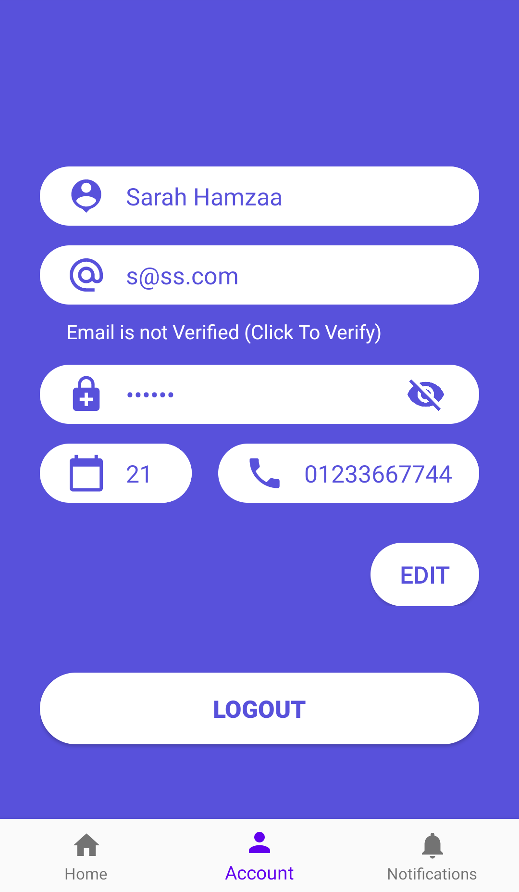
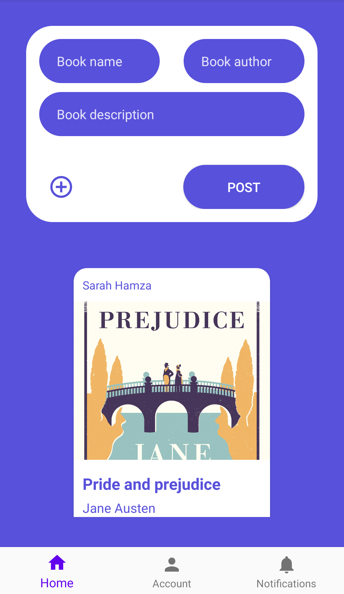
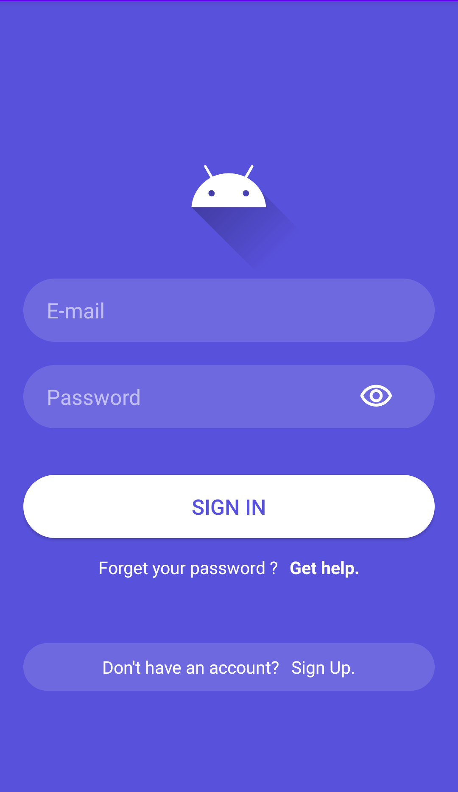
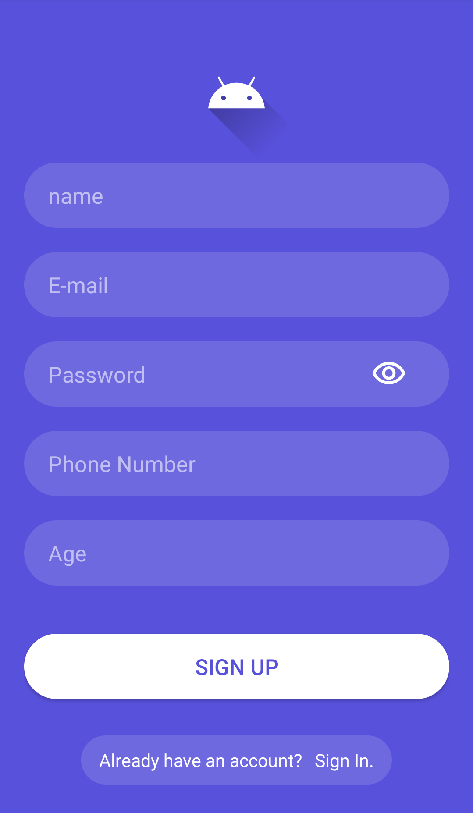

## Booklac
Booklac is an android app which allow people to exchange, sell or buy secondhand books.

## Motivation
This application is considered as my graduation project of [ITI](https://www.iti.gov.eg/iti/about-us) summer training

## Description
You can signup/in to your account then you'll b moved to the home page where you can post or add a book with or without an image of it. 
To post a book you must provide some informations about it like the title, author and description.
You can move left or right to other pages like the account page where you can edit your informations, verify your email and logout.
The final page is the notifcations page and it's not finished yet.

## Screenshots

